# TAIRiX /'taɪ.rɪks/ - An attempt at making a sensible OS.

A security-first, multi-user, multi-core operating system written in Rust,
targeting bare-metal x86_64, AArch64, RISC-V 64, and the browser via wasm32. TAIRiX is _not_ Linux.

This file is intentionally brief. Authoritative documents live alongside the
code:

- [`AGENTS.md`](./AGENTS.md) — binding engineering charter.
- [`PLAN.md`](./PLAN.md) — staged delivery plan.
- [`docs/`](./docs) — long-form architecture, security, and platform book
  (built with mdBook).

## Status
**Work in progress.** - There is a long way to go before this project is ready
for prime time, if it ever will be. <span style="color:red">**Do not expect anything to work yet, Do *not* use it.**</span>

## Screenshots

Here are some screenshots of TAIRiX running, showcasing the current state of the project 
<table>
  <tr>
    <td align="center"><a href="docs/screenshots/boot-filesystem-unlock.png">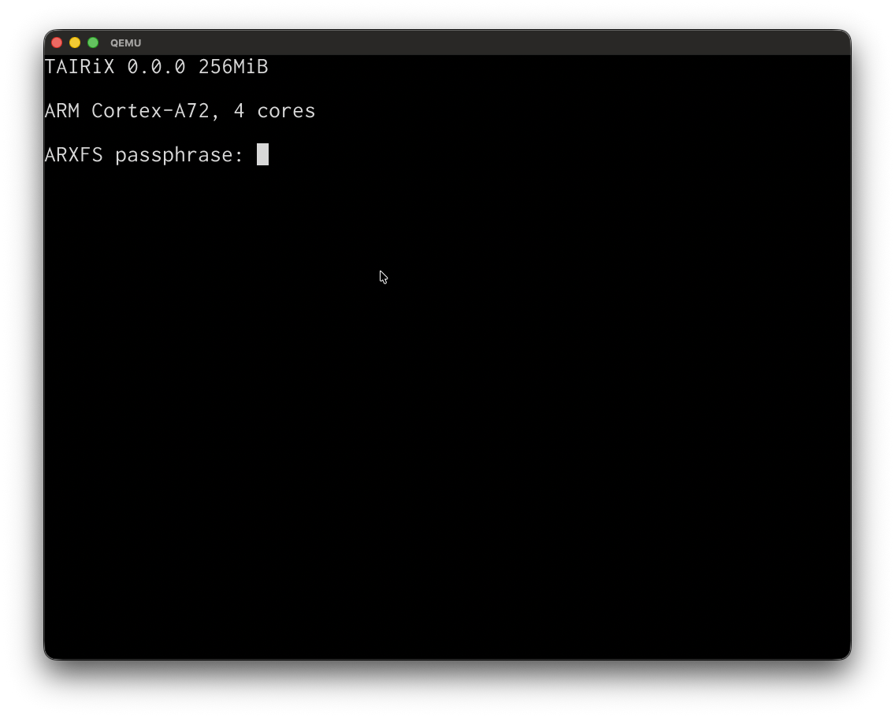</a><br><sub>Filesystem unlock</sub></td>
    <td align="center"><a href="docs/screenshots/basic-desktop.png">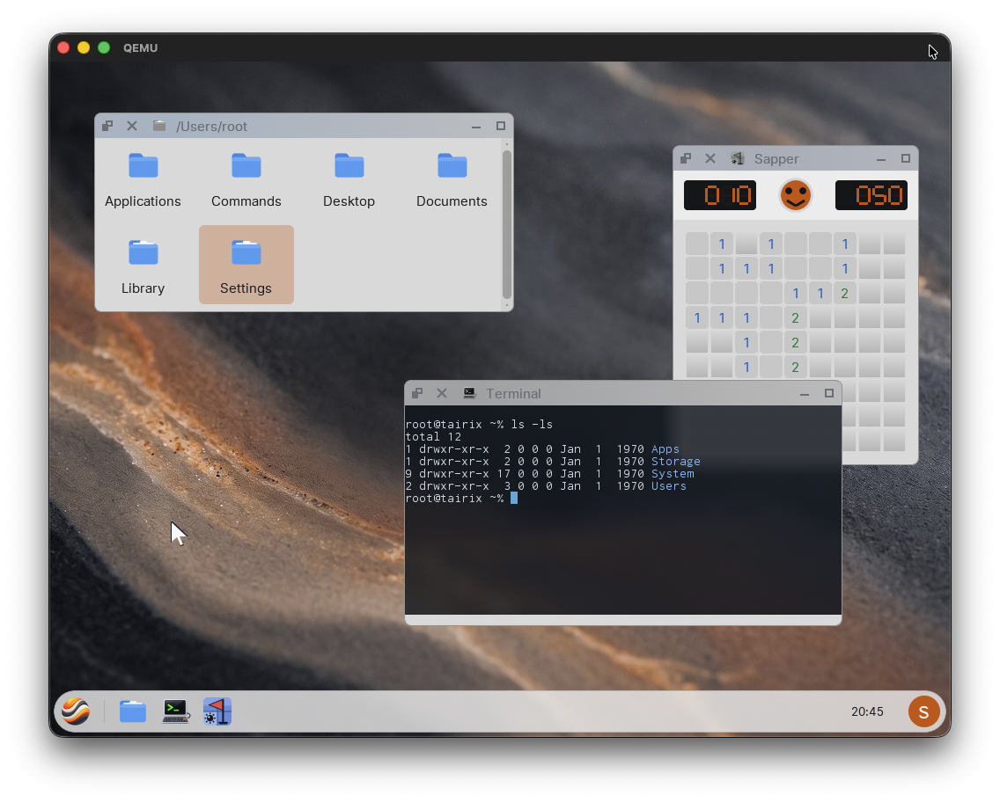</a><br><sub>The desktop</sub></td>
    <td align="center"><a href="docs/screenshots/wallpaper.png">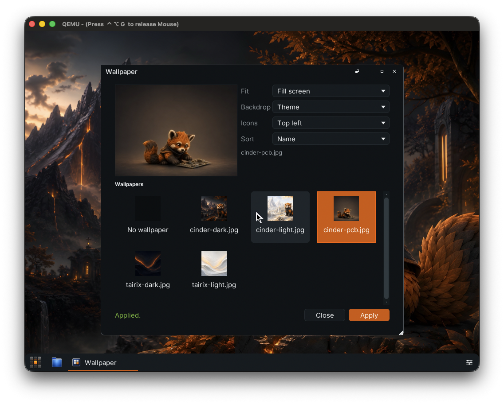</a><br><sub>The wallpaper chooser</sub></td>
    <td align="center"><a href="docs/screenshots/filemanager.png">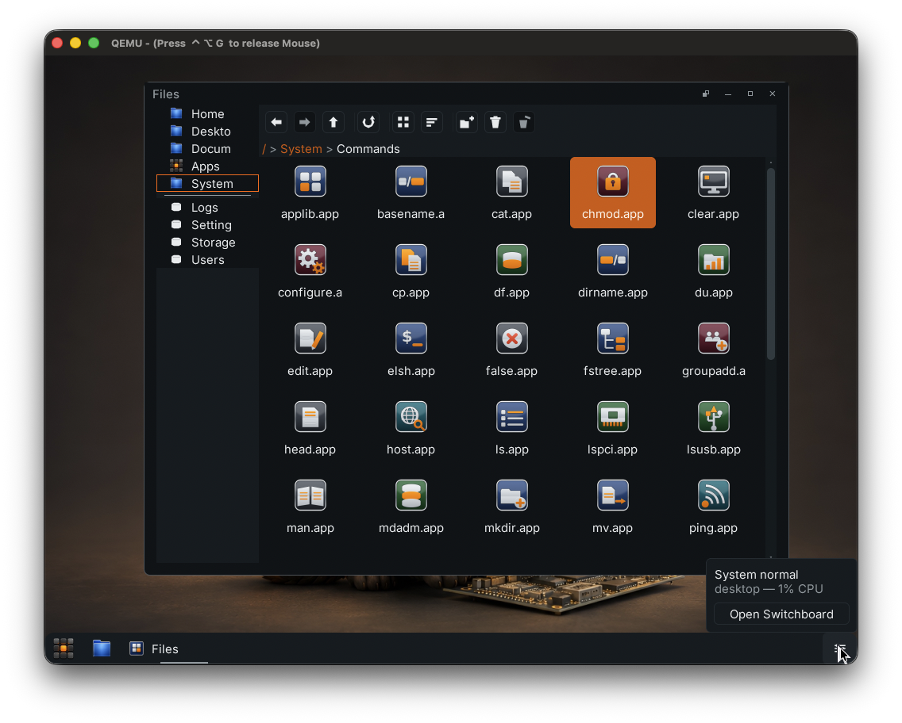</a><br><sub>File manager PoC</sub></td>
    <td align="center"><a href="docs/screenshots/switchboard.png">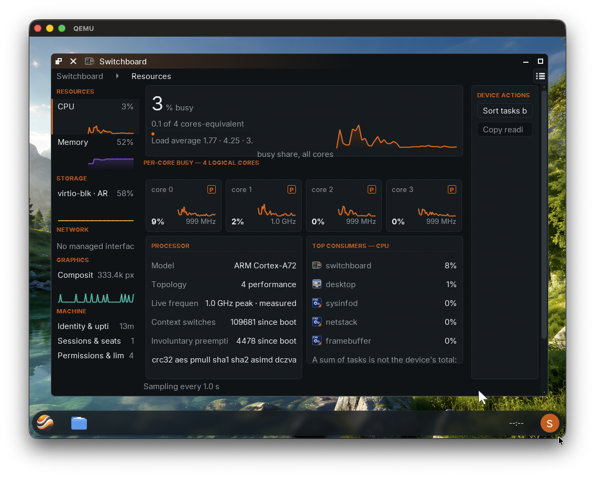</a><br><sub>Switchboard (task&nbsp;manager)</sub></td>

</tr>
  <tr>
    <td align="center"><a href="docs/screenshots/user-login.png">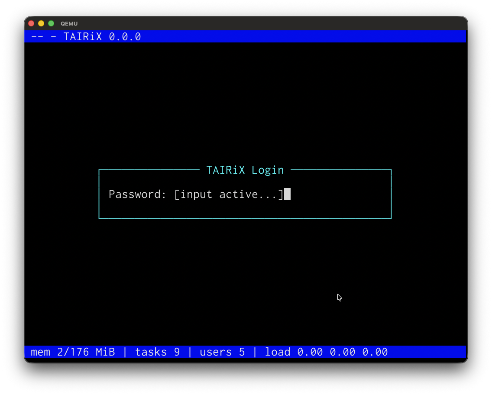</a><br><sub>User login</sub></td>
    <td align="center"><a href="docs/screenshots/booted-and-logged-in.png">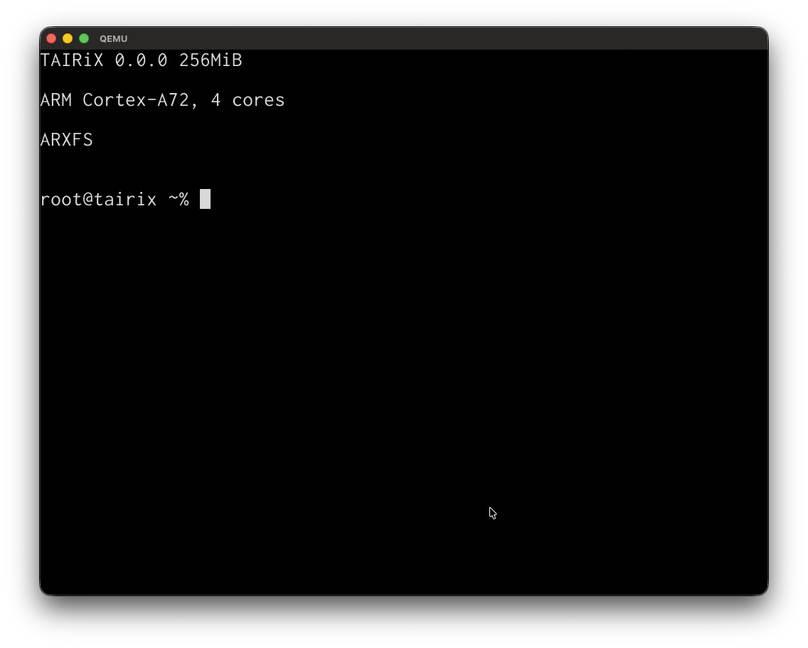</a><br><sub>Logged in</sub></td>
    <td align="center"><a href="docs/screenshots/japanese-text.png">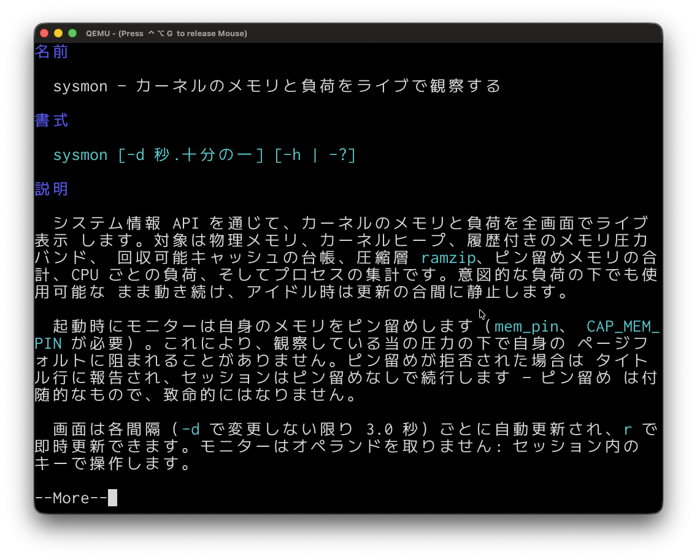</a><br><sub>Japanese text</sub></td>
    <td align="center"><a href="docs/screenshots/system-monitor.png">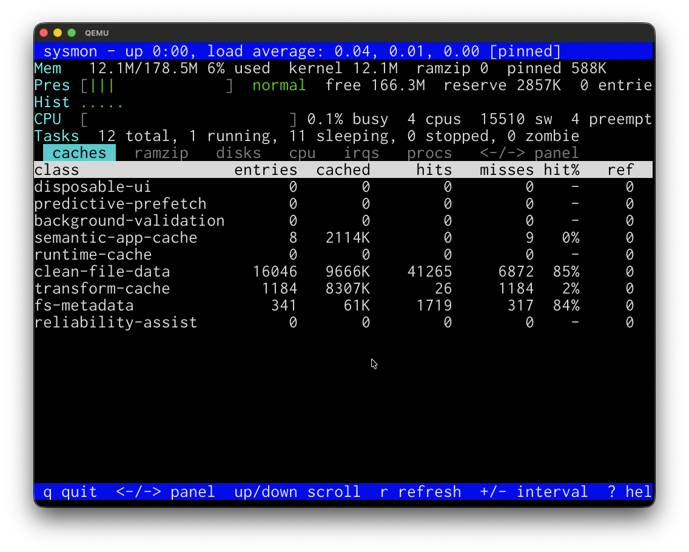</a><br><sub>sysmon app</sub></td>
    <td align="center"><a href="docs/screenshots/top.app.png">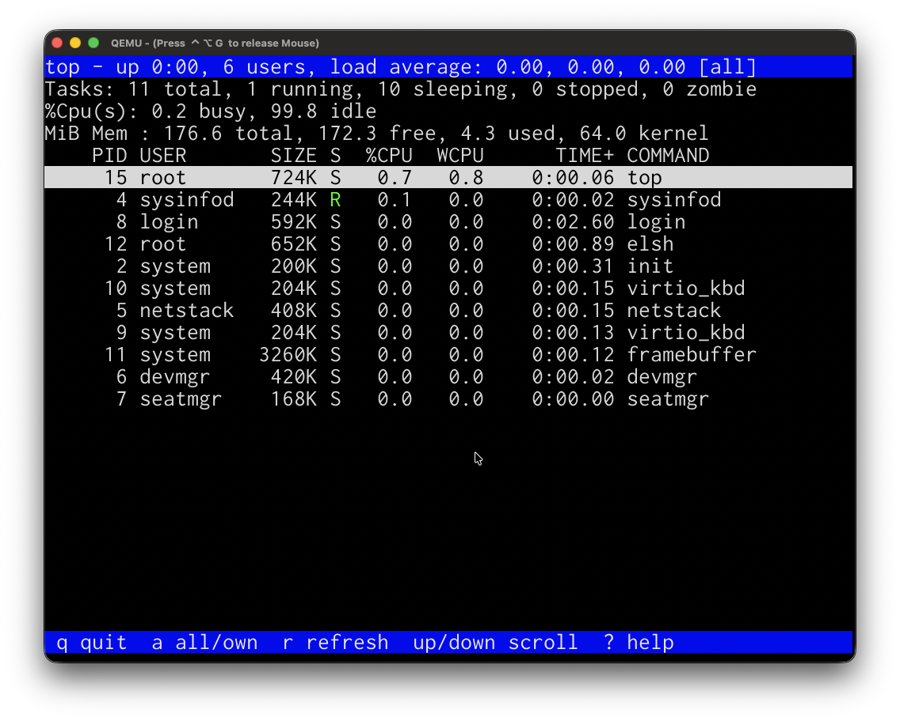</a><br><sub>top app</sub></td> 
</tr>
<tr>
    <td align="center"><a href="docs/screenshots/supervisor.png">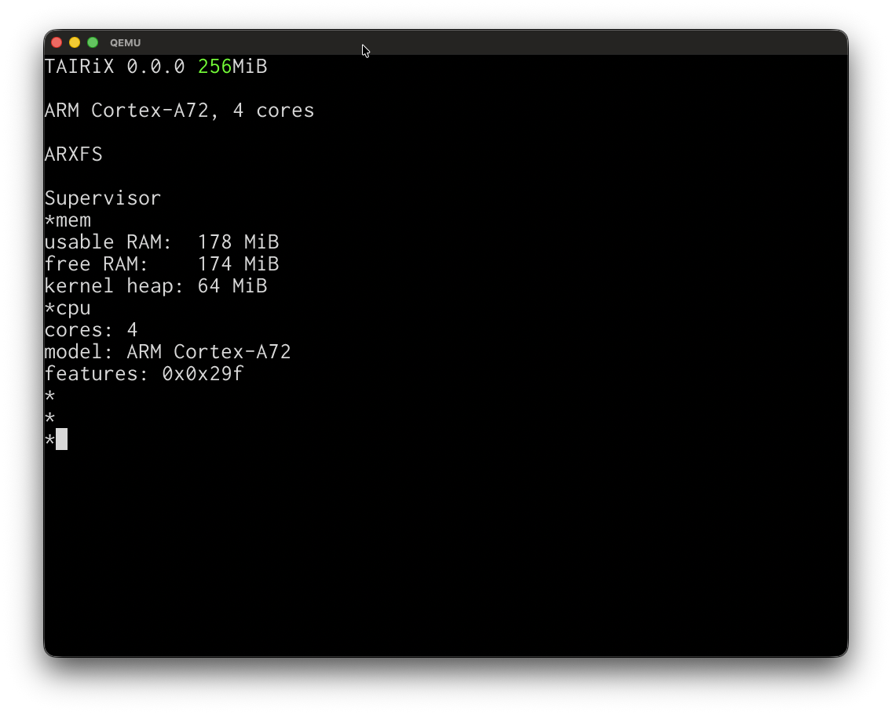</a><br><sub>Supervisor preboot monitor</sub></td>
    <td align="center"><a href="docs/screenshots/transparency-blur-compositor.png">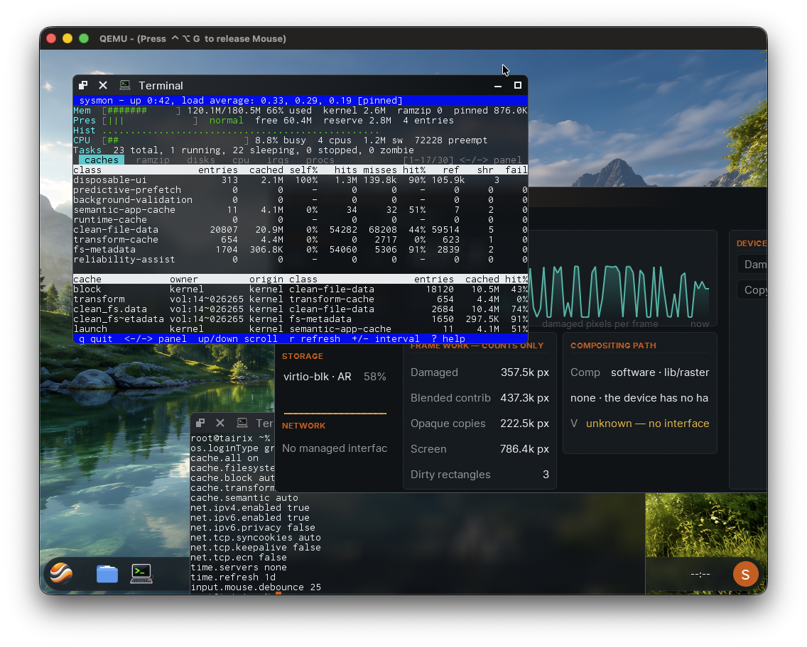</a><br><sub>Compositor with transparency/blur support</sub></td>

</tr>
</table>

## Feature / architecture support

Per-architecture state of features whose support varies by target. Legend:
`✓` implemented · `◐` in progress · `▢` planned · `—` not applicable.
Architecture-neutral subsystems (kernel core, scheduler, IPC, capabilities,
filesystems, userland, desktop) are tracked in [`PLAN.md`](./PLAN.md) and,
for filesystems, the feature section below.

| Feature | x86_64 | aarch64 | riscv64 | wasm32 |
| --- | :-: | :-: | :-: | :-: |
| Boot + early console | ✓ | ✓ | ✓ | ✓ |
| Early-boot RAM self-test | ✓ | ✓ | ✓ | — |
| Hardware discovery | ✓ ACPI | ✓ FDT | ✓ FDT | ✓ host |
| MMU / paging | ✓ | ✓ | ✓ | — |
| Context switch | ✓ | ✓ | ✓ | — |
| Interrupts + timer | ✓ | ✓ | ✓ | ✓ |
| SMP bring-up | ✓ | ✓ | ✓ | ✓ |
| Heterogeneous CPUs (big.LITTLE / hybrid) | ✓ CPUID | ✓ FDT | ▢ | — |
| Cache-aware scheduling (LLC-aware) | ▢ | ▢ | ▢ | — |
| Cross-CPU TLB shootdown | ✓ | ✓ | ✓ | — |
| Syscall entry | ✓ | ✓ | ✓ | ✓ |
| User-mode execution (ring 3 / EL0 / U-mode) | ✓ | ✓ | ✓ | — |
| Threads within a process (`thread_create`, futex) | ✓ | ✓ | ✓ | — |
| Multi-core software compositing (banded composite + blur) | ✓ | ✓ | ✓ | — |
| C-callable ABI (`abi-v1`, non-Rust) | ✓ | ✓ | ✓ | — |
| Machine power-off / restart (`system_power`) | ◐ restart | ✓ PSCI | ✓ SBI | — |
| Side-channel mitigation | ✓ | ✓ | ✓ | ✓ |
| Memory tagging (software UAF floor) | ✓ | ✓ | ✓ | ✓ |
| Runtime CPU-feature dispatch (CRC-32C accel) | ✓ SSE4.2 | ✓ crc32c | — baseline | — baseline |
| Runtime CPU-feature dispatch (page-zero accel) | ✓ ERMS | ✓ DC ZVA | — baseline | — baseline |
| Crypto backend availability + boot self-test (SHA-256) | ✓ SHA-NI | ▢ soft | — soft | — soft |
| Framebuffer / display | ✓ | ✓ | ▢ | ✓ |
| Sandboxed font service (`fontd`, glyph rendering) | ✓ floor | ✓ store | ✓ floor | ▢ |
| Graphical login screen (`greeter.app`) | ◐ | ◐ | ▢ | ▢ |
| Fast user switching (concurrent desktop sessions) | ◐ | ◐ | ▢ | ▢ |
| Block storage | ✓ virtio | ✓ virtio + eMMC + USB | ✓ virtio | — |
| Networking | ◐ virtio | ◐ virtio | ◐ virtio | — |
| Network offloads (RX/TX csum, TSO, mergeable RX, multiqueue RX) | ✓ virtio | ✓ virtio | ✓ virtio | — |
| Input devices | ✓ ps2 + USB | ✓ virtio + USB | ✓ virtio | ✓ host |
| Production kernel binary | ✓ | ✓ | ▢ | ▢ |
| Bootable image | ▢ iso | ✓ rpi.img | ▢ | ▢ |


## Filesystem feature support

This table compares the ARXFS *design as implemented* against what each
foreign filesystem itself provides — the on-disk format and its canonical
Linux implementation for ext4/btrfs/XFS/bcachefs — **not** against TAIRiX's
interoperability drivers.
Legend: `✓` provided (optional features count) · `◐` partial ·
`▢` recognised future stage · `—` not provided.

| Feature | ARXFS | ext4 | btrfs | XFS | bcachefs |
| --- | :-: | :-: | :-: | :-: | :-: |
| TAIRiX driver | ✓ native | ✓ read/write | — | — | — |
| Long file names (255 bytes) | ✓ | ✓ | ✓ | ✓ | ✓ |
| POSIX owner / mode / ACL | ✓ | ✓ | ✓ | ✓ | ✓ |
| Per-inode capability gate | ✓ | — | — | — | — |
| 64-bit ns timestamps (pre-1970 / post-2038) | ✓ | ✓ | ✓ | ✓ | ✓ |
| Encryption at rest | ✓ always-on | ✓ fscrypt | — | — | ✓ |
| Checksummed metadata | ✓ keyed + mirrored | ✓ | ✓ | ✓ | ✓ |
| Data checksums | ✓ | — | ✓ | — | ✓ |
| Metadata self-heal (redundant copies) | ✓ | — | ✓ DUP | — | ✓ |
| Data self-heal (redundancy) | ▢ | — | ✓ RAID | — | ✓ replicas |
| Transparent compression | ✓ | — | ✓ | — | ✓ |
| Deduplication | ✓ inline | — | ✓ offline | ✓ offline | — |
| Reflink / COW file clones | ✓ | — | ✓ | ✓ | ✓ |
| Snapshots | — | — | ✓ | — | ✓ |
| Sparse files (holes) | ✓ | ✓ | ✓ | ✓ | ✓ |
| Symbolic links | ✓ target as node data | ✓ fast + slow | ✓ | ✓ | ✓ |
| Crash consistency | ✓ COW | ✓ journal | ✓ COW | ✓ journal | ✓ COW |
| Multi-device / RAID | — | — | ✓ | — | ✓ |
| Online scrub | ✓ verify + metadata repair | — | ✓ | ✓ | ✓ |
| Offline check / repair | ✓ + rescue | ✓ | ✓ | ✓ | ✓ |
| TRIM / discard | ✓ | ✓ | ✓ | ✓ | ✓ |
| Online grow | ✓ | ✓ | ✓ | ✓ | ✓ |
| Device-health monitoring → triggered scrub | ✓ | — | — | — | — |

TAIRiX ships drivers for ARXFS (native) and for ext4, FAT32, and ADFS as
interoperability drivers for foreign volumes

## Security & attack-vector prevention

The attack classes TAIRiX forecloses, and where each defence stands per
target. The structural defences (capability authority, process isolation,
no ambient root, signed code) are designed in from the kernel up.

| Defence (`AGENTS.md` §) | Attack vector closed | x86_64 | aarch64 | riscv64 | wasm32 |
| --- | --- | :-: | :-: | :-: | :-: |
| Capability authority, no ambient root (§4, §5.2) | Privilege escalation, confused-deputy, setuid abuse | ✓ | ✓ | ✓ | ✓ |
| Hardware process isolation (§4) | Cross-process memory disclosure / tampering | ✓ MMU | ✓ MMU | ✓ MMU | ✓ host |
| Per-call capability + input checks, fail-closed (§5.4) | Unauthorised syscall/IPC/driver access | ✓ | ✓ | ✓ | ✓ |
| Kernel per-CPU identity re-established at every trap entry (§4, §5.4) | A user-writable register steering the kernel onto another CPU's per-CPU state | ✓ GS base | ✓ `TPIDR_EL1` | ✓ `tp` anchor | — |
| W^X + position-independent executables (§19.2) | Code injection, writable-executable memory | ✓ | ✓ | ✓ | ✓ |
| Load-time CFI tag vs syscall-hash (§19.2) | Control-flow hijacking across ABI/IPC | ✓ | ✓ | ✓ | ✓ |
| Software memory tagging (§19.10) | Use-after-free (software floor) | ✓ | ✓ | ✓ | ✓ |
| Zero-on-free of secrets (§4) | Secret recovery from reused memory | ✓ | ✓ | ✓ | ✓ |
| Re-authenticated screen lock (§5.4, §10) | Unattended-session takeover at the keyboard | ✓ | ✓ | ✓ | ✓ |
| Login screen split from the session authority (§4, §5.2) | Compromised login surface reading credentials or starting a session | ✓ | ✓ | ✓ | ✓ |
| Terminal purged at every session boundary (§5.4) | Next user reading the last session's screen, hidden alternate screen, scrollback, or type-ahead | ✓ | ✓ grids | ✓ | ✓ |
| Window identity from the attested launch record (§4, §5.4) | An application dressing its window as another in the title bar or taskbar | ✓ | ✓ | ✓ | ✓ |
| Speculation barriers on syscall / context switch (§19.1) | Spectre / MDS / L1TF / MMIO stale data | ✓ | ✓ | ✓ | ✓ host |
| Stack + slab guard pages, hardware fault (§4) | Stack/heap overrun into adjacent memory | ✓ | ✓ | ✓ | — |
| Encrypted root + encrypted swap, no plaintext mode (§4, §11) | Secret/data recovery at rest | ✓ | ✓ | ✓ | — |
| Capability-gated, bounded DMA/MMIO (§4, §18.1) | Malicious-device DMA, unbounded device memory | ✓ | ✓ | ✓ | — |
| Continuous fuzzing of parsers/ABI/IPC/syscalls (§19.6) | Input-handling memory-safety bugs | ✓ | ✓ | ✓ | ✓ |
| Hash-chained tamper-evident audit log (§19.4) | Log tampering, forensic evasion | ◐ | ◐ | ◐ | ◐ |
| Signed driver / app manifests (§9, §16.5) | Unsigned / malicious code execution | ◐ | ◐ | ◐ | ◐ |
| Supply-chain pinning: SBOM, source-hash, advisory SLA (§19.3) | Dependency compromise (xz-utils class) | ◐ | ◐ | ◐ | ◐ |
| Stack canaries / shadow stack (§19.2) | Return-address / saved-state overwrite | ◐ | ◐ | ◐ | ◐ |
| KPTI / kernel-user address-space isolation (§19.1) | Meltdown-class kernel-memory disclosure | ◐ | ◐ | ◐ | — |
| Minimum-capability parser sandboxes (§19.5) | Untrusted-input parser compromise (font/image/net) | ▢ | ▢ | ▢ | ▢ |
| Hardware memory tagging — MTE / ADI (§19.10) | Use-after-free (hardware-enforced) | — | ▢ | ▢ | — |


## Building

```sh
cargo xtask ci          # Full pipeline a PR must pass
cargo xtask test        # Host-side unit and integration tests
cargo xtask docs-check  # rustdoc + mdBook (with link checking)
cargo xtask run --target aarch64-rpi --profile debug
                        # Build the image and boot it in a QEMU window
                        # (display + keyboard/mouse; also --profile installer)
cargo xtask --help      # All subcommands
```

The pinned nightly toolchain in [`rust-toolchain.toml`](./rust-toolchain.toml)
is installed automatically when `rustup` is present. External tools used by
`cargo xtask ci` are:

```sh
cargo install --locked cargo-deny mdbook
```

The C-ABI conformance tests (`cargo xtask test --qemu`) additionally need the
pinned `clang` / `ld.lld` (`tairix_cc::REQUIRED_CLANG_VERSION`). Install them
once and the build finds them automatically — no environment variables — from
Homebrew (`brew install llvm lld`) or apt.llvm.org (`apt install clang-22
lld-22`); see [`tools/cc/README.md`](./tools/cc/README.md) for the search order.

## Licence

Licensed under the [GNU General Public License v2.0 or later](./LICENSE)
(GPL-2.0-or-later), with an additional syscall / ABI exception
(`TAIRiX-syscall-note`) that keeps user-space programs which merely use the
kernel's system calls or its published syscall / ABI interface definitions
from being treated as derived works. See [`LICENSE`](./LICENSE) for the full
text.

TAIRiX is an independent, open-source hobby project. It is not affiliated with, endorsed by, or supported by the Rust Project or the Rust Foundation.
