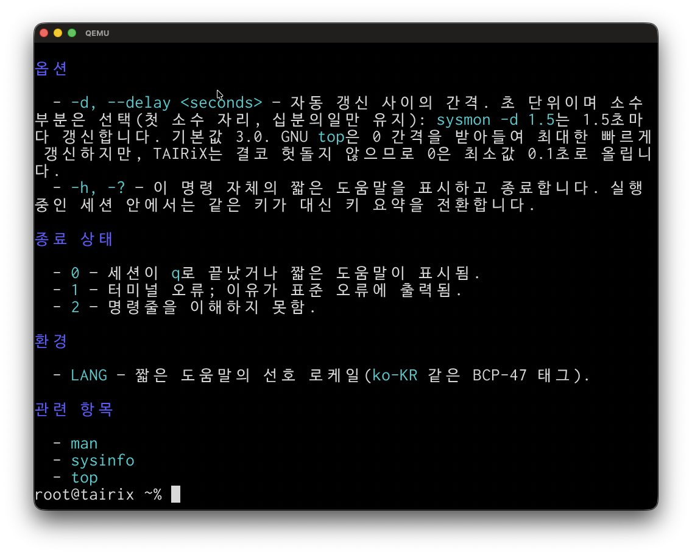

# TAIRiX /'taɪ.rɪks/ - An OS experiment.

A security-first, multi-user, multi-core operating system written in Rust,
targeting bare-metal x86_64, AArch64, RISC-V 64, and the browser via
`wasm32-unknown-unknown`.

This file is intentionally brief. Authoritative documents live alongside the
code:

- [`AGENTS.md`](./AGENTS.md) — binding engineering charter.
- [`PLAN.md`](./PLAN.md) — staged delivery plan.
- [`docs/`](./docs) — long-form architecture, security, and platform book
  (built with mdBook).

## Status
**Work in progress.** - There is a long way to go before this project is ready
for prime time, if it ever will be. <span style="color:red">**Do not expect anything to work yet, Do *not* use it.**</span>

## Screenshots

Early days, but here is TAIRiX running (aarch64, Raspberry Pi image booted in
QEMU). Click a thumbnail for the full-size image.

<table>
  <tr>
    <td align="center"><a href="docs/screenshots/boot-filesystem-unlock.png"></a><br><sub>Filesystem unlock</sub></td>
    <td align="center"><a href="docs/screenshots/user-login.png"></a><br><sub>User login</sub></td>
    <td align="center"><a href="docs/screenshots/booted-and-logged-in.png"></a><br><sub>Logged in</sub></td>
    <td align="center"><a href="docs/screenshots/basic-desktop.png"></a><br><sub>basic desktop PoC</sub></td>
    <td align="center"><a href="docs/screenshots/top.app.png"></a><br><sub>top app</sub></td>
  </tr>
  <tr>
    <td align="center"><a href="docs/screenshots/wide-character-support-korean.png"></a><br><sub>Korean text</sub></td>
    <td align="center"><a href="docs/screenshots/japanese-text.png"></a><br><sub>Japanese text</sub></td>
  </tr>
</table>

## Feature / architecture support

Per-architecture state of features whose support varies by target. Legend:
`✓` implemented · `◐` in progress · `▢` planned · `—` not applicable.
Architecture-neutral subsystems (kernel core, scheduler, IPC, capabilities,
filesystems, userland, desktop) are tracked in [`PLAN.md`](./PLAN.md) and,
for filesystems, the feature section below.

| Feature | x86_64 | aarch64 | riscv64 | wasm32 |
| --- | :-: | :-: | :-: | :-: |
| Boot + early console | ✓ | ✓ | ✓ | ✓ |
| Early-boot RAM self-test | ✓ | ✓ | ✓ | — |
| Hardware discovery | ✓ ACPI | ✓ FDT | ✓ FDT | ✓ host |
| MMU / paging | ✓ | ✓ | ✓ | — |
| Context switch | ✓ | ✓ | ✓ | — |
| Interrupts + timer | ✓ | ✓ | ✓ | ✓ |
| SMP bring-up | ✓ | ✓ | ✓ | ✓ |
| Heterogeneous CPUs (big.LITTLE / hybrid) | ✓ CPUID | ✓ FDT | ▢ | — |
| Cache-aware scheduling (LLC-aware) | ▢ | ▢ | ▢ | — |
| Cross-CPU TLB shootdown | ✓ | ✓ | ✓ | — |
| Syscall entry | ✓ | ✓ | ✓ | ✓ |
| User-mode execution (ring 3 / EL0 / U-mode) | ✓ | ✓ | ✓ | — |
| C-callable ABI (`abi-v1`, non-Rust) | ✓ | ✓ | ✓ | — |
| Side-channel mitigation | ✓ | ✓ | ✓ | ✓ |
| Memory tagging (software UAF floor) | ✓ | ✓ | ✓ | ✓ |
| Framebuffer / display | ✓ | ✓ | ▢ | ✓ |
| Block storage | ✓ virtio | ✓ virtio + eMMC + USB | ✓ virtio | — |
| Networking | ◐ virtio | ◐ virtio | ◐ virtio | — |
| Input devices | ✓ ps2 + USB | ✓ virtio + USB | ✓ virtio | ✓ host |
| Production kernel binary | ✓ | ✓ | ▢ | ▢ |
| Bootable image | ▢ iso | ✓ rpi.img | ▢ | ▢ |

Networking is the virtio-net link-layer driver plus the user-space
`netstack` service: a dual-stack (IPv4 + IPv6) network layer — ARP,
Neighbour Discovery, ICMP/ICMPv6 echo + errors, fragment reassembly,
routing, UDP with multicast, and TCP (RFC 9293 with CUBIC/NewReno
congestion control, SACK loss recovery, and SYN-cookie listeners) — over a
capability-gated shared-memory frame-ring seam, plus the datagram and
stream socket ABIs. A discovered NIC's driver runs as its own user process
and its frame channel is autobound into the running stack by the device
manager (`plans/NETWORK.md` N4d) — proven end-to-end in a two-process live
boot on all three Tier-1 targets, where the production boot autoloads the
virtio-net driver, the stack auto-configures the interface's IPv6
link-local, and it answers a host peer's echo (N4e-β on aarch64,
N4e-riscv64, and N4e-x86_64 over virtio-PCI with kernel-routed MSI-X). The
driver negotiates receive-checksum offload (`VIRTIO_NET_F_GUEST_CSUM`) and
the stack skips the redundant fold for a device-validated frame; it also
negotiates TCP transmit-checksum offload (`VIRTIO_NET_F_CSUM`), handing the
device a segment with only the partial pseudo-header checksum to complete —
the software path stays the byte-for-byte conformance oracle for both
(N7a, N7b-1). TCP-segmentation (TSO) and UDP transmit offload, observability
tooling, and interface configuration remain, hence still `◐`.

## Filesystem feature support

This table compares the ARXFS *design as implemented* against what each
foreign filesystem itself provides — the on-disk format and its canonical
Linux implementation for ext4/btrfs/XFS/bcachefs — **not** against TAIRiX's
interoperability drivers.
Legend: `✓` provided (optional features count) · `◐` partial ·
`▢` recognised future stage · `—` not provided.

| Feature | ARXFS | ext4 | btrfs | XFS | bcachefs |
| --- | :-: | :-: | :-: | :-: | :-: |
| TAIRiX driver | ✓ native | ✓ read/write | — | — | — |
| Long file names (255 bytes) | ✓ | ✓ | ✓ | ✓ | ✓ |
| POSIX owner / mode / ACL | ✓ | ✓ | ✓ | ✓ | ✓ |
| Per-inode capability gate | ✓ | — | — | — | — |
| 64-bit ns timestamps (pre-1970 / post-2038) | ✓ | ✓ | ✓ | ✓ | ✓ |
| Encryption at rest | ✓ always-on | ✓ fscrypt | — | — | ✓ |
| Checksummed metadata | ✓ keyed + mirrored | ✓ | ✓ | ✓ | ✓ |
| Data checksums | ✓ | — | ✓ | — | ✓ |
| Metadata self-heal (redundant copies) | ✓ | — | ✓ DUP | — | ✓ |
| Data self-heal (redundancy) | ▢ | — | ✓ RAID | — | ✓ replicas |
| Transparent compression | ✓ | — | ✓ | — | ✓ |
| Deduplication | ✓ inline | — | ✓ offline | ✓ offline | — |
| Reflink / COW file clones | ✓ | — | ✓ | ✓ | ✓ |
| Snapshots | — | — | ✓ | — | ✓ |
| Sparse files (holes) | ✓ | ✓ | ✓ | ✓ | ✓ |
| Crash consistency | ✓ COW | ✓ journal | ✓ COW | ✓ journal | ✓ COW |
| Multi-device / RAID | — | — | ✓ | — | ✓ |
| Online scrub | ✓ verify + metadata repair | — | ✓ | ✓ | ✓ |
| Offline check / repair | ✓ + rescue | ✓ | ✓ | ✓ | ✓ |
| TRIM / discard | ✓ | ✓ | ✓ | ✓ | ✓ |
| Online grow | ✓ | ✓ | ✓ | ✓ | ✓ |
| Device-health monitoring → triggered scrub | ✓ | — | — | — | — |

TAIRiX ships drivers for ARXFS (native) and for ext4, FAT32, and ADFS as
interoperability drivers for foreign volumes: ext4 maintains every on-disk
checksum it mounts (`metadata_csum`, `gdt_csum`, `64bit`) and fails closed to
read-only on feature sets outside its write allow-list; FAT32 has no on-disk
security metadata (ownership and permissions live in the VFS layer); ADFS
covers every Acorn `FileCore` format (S/M/L/D old map, E/F new map, E+/F+
big directories, old- and new-map hard discs), validating every on-disc
checksum and surfacing RISC OS load/exec/filetype/datestamp metadata through
the shared `acorn.*` attribute keys. The
drivers' declared-limit timestamp surface is staged per `AGENTS.md` §21.
btrfs, XFS, and bcachefs have no TAIRiX driver and appear only for
comparison — including what ARXFS does *not* do: snapshots, multi-device
pooling/RAID, and self-healing of *data* (ARXFS today detects and classifies
bad data blocks through its three-layer integrity pipeline but repairs only
its mirrored metadata; data reconstruction is a recognised later stage).
Per-driver detail lives in each crate's `README.md` under
[`drivers/filesystem/`](./drivers/filesystem) and the
[`docs/src/filesystem/`](./docs/src/filesystem) book pages.

## Security & attack-vector prevention

The attack classes TAIRiX forecloses, and where each defence stands per
target. The structural defences (capability authority, process isolation,
no ambient root, signed code) are designed in from the kernel up; the
hardening defences below are the [`AGENTS.md`](./AGENTS.md) §4/§5/§19
controls, tracked against the §19 burn-down in [`PLAN.md`](./PLAN.md). Same
legend as above: `✓` implemented · `◐` in progress · `▢` planned ·
`—` not applicable. Architecture-neutral rows are `✓` on every target by
design; rows that depend on the MMU or on backing storage are `—` on
`wasm32` (it runs in the browser's sandbox with no page tables or swap).

| Defence (`AGENTS.md` §) | Attack vector closed | x86_64 | aarch64 | riscv64 | wasm32 |
| --- | --- | :-: | :-: | :-: | :-: |
| Capability authority, no ambient root (§4, §5.2) | Privilege escalation, confused-deputy, setuid abuse | ✓ | ✓ | ✓ | ✓ |
| Hardware process isolation (§4) | Cross-process memory disclosure / tampering | ✓ MMU | ✓ MMU | ✓ MMU | ✓ host |
| Per-call capability + input checks, fail-closed (§5.4) | Unauthorised syscall/IPC/driver access | ✓ | ✓ | ✓ | ✓ |
| W^X + position-independent executables (§19.2) | Code injection, writable-executable memory | ✓ | ✓ | ✓ | ✓ |
| Load-time CFI tag vs syscall-hash (§19.2) | Control-flow hijacking across ABI/IPC | ✓ | ✓ | ✓ | ✓ |
| Software memory tagging (§19.10) | Use-after-free (software floor) | ✓ | ✓ | ✓ | ✓ |
| Zero-on-free of secrets (§4) | Secret recovery from reused memory | ✓ | ✓ | ✓ | ✓ |
| Speculation barriers on syscall / context switch (§19.1) | Spectre / MDS / L1TF / MMIO stale data | ✓ | ✓ | ✓ | ✓ host |
| Stack + slab guard pages, hardware fault (§4) | Stack/heap overrun into adjacent memory | ✓ | ✓ | ✓ | — |
| Encrypted root + encrypted swap, no plaintext mode (§4, §11) | Secret/data recovery at rest | ✓ | ✓ | ✓ | — |
| Capability-gated, bounded DMA/MMIO (§4, §18.1) | Malicious-device DMA, unbounded device memory | ✓ | ✓ | ✓ | — |
| Continuous fuzzing of parsers/ABI/IPC/syscalls (§19.6) | Input-handling memory-safety bugs | ✓ | ✓ | ✓ | ✓ |
| Hash-chained tamper-evident audit log (§19.4) | Log tampering, forensic evasion | ◐ | ◐ | ◐ | ◐ |
| Signed driver / app manifests (§9, §16.5) | Unsigned / malicious code execution | ◐ | ◐ | ◐ | ◐ |
| Supply-chain pinning: SBOM, source-hash, advisory SLA (§19.3) | Dependency compromise (xz-utils class) | ◐ | ◐ | ◐ | ◐ |
| Stack canaries / shadow stack (§19.2) | Return-address / saved-state overwrite | ◐ | ◐ | ◐ | ◐ |
| KPTI / kernel-user address-space isolation (§19.1) | Meltdown-class kernel-memory disclosure | ◐ | ◐ | ◐ | — |
| Minimum-capability parser sandboxes (§19.5) | Untrusted-input parser compromise (font/image/net) | ▢ | ▢ | ▢ | ▢ |
| Hardware memory tagging — MTE / ADI (§19.10) | Use-after-free (hardware-enforced) | — | ▢ | ▢ | — |

`◐` rows have their architecture-neutral core landed with the remaining
stage-blocked work (signed log anchors, the driver-signing trust anchor,
reproducible builds, shadow stacks, KPTI page-table isolation) tracked in
the [`PLAN.md`](./PLAN.md) §19 burn-down — not deferred by choice. The
explicit non-goals (phishing, physical/cold-boot attacks, compromise of an
admin capability holder, compiler bugs) are listed in `AGENTS.md` §19.9.

## Building

```sh
cargo xtask ci          # Full pipeline a PR must pass
cargo xtask test        # Host-side unit and integration tests
cargo xtask docs-check  # rustdoc + mdBook (with link checking)
cargo xtask run --target aarch64-rpi --profile debug
                        # Build the image and boot it in a QEMU window
                        # (display + keyboard/mouse; also --profile installer)
cargo xtask --help      # All subcommands
```

The pinned nightly toolchain in [`rust-toolchain.toml`](./rust-toolchain.toml)
is installed automatically when `rustup` is present. External tools used by
`cargo xtask ci` are:

```sh
cargo install --locked cargo-deny mdbook
```

The C-ABI conformance tests (`cargo xtask test --qemu`) additionally need the
pinned `clang` / `ld.lld` (`tairix_cc::REQUIRED_CLANG_VERSION`). Install them
once and the build finds them automatically — no environment variables — from
Homebrew (`brew install llvm lld`) or apt.llvm.org (`apt install clang-22
lld-22`); see [`tools/cc/README.md`](./tools/cc/README.md) for the search order.

## Licence

Licensed under the [GNU General Public License v2.0 or later](./LICENSE)
(GPL-2.0-or-later), with an additional syscall / ABI exception
(`TAIRiX-syscall-note`) that keeps user-space programs which merely use the
kernel's system calls or its published syscall / ABI interface definitions
from being treated as derived works. See [`LICENSE`](./LICENSE) for the full
text.

TAIRiX is an independent, open-source hobby project. It is not affiliated with, endorsed by, or supported by the Rust Project or the Rust Foundation.
